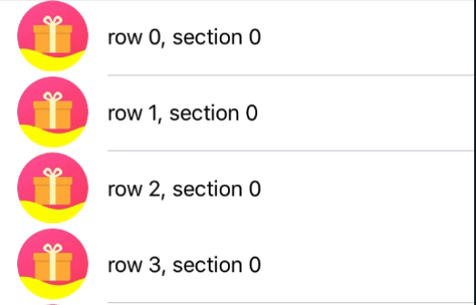

# JWWaveView
[](https://travis-ci.org/Alex1989Wang/JWWaveView)
[](http://cocoapods.org/pods/JWWaveView)
[](http://cocoapods.org/pods/JWWaveView)
[](http://cocoapods.org/pods/JWWaveView)

JWWaveView provides a convenient way to add water-waving effect to any of your UIView instance. 

## Requirements

- iOS 8.0+
- ARC

## Example

To run the example project, clone the repo, and run `pod install` from the Example directory first.

<div align='center'>

</div>

## Installation with CocoaPods

[CocoaPods](http://cocoapods.org) is a dependency manager for developing iOS or OSX apps, which automates and simplifies the process of using 3rd-party libraries in your projects. See the ["Getting Started" guide for more information](https://guides.cocoapods.org/using/getting-started.html). You can install it with the following command:

```bash
$ gem install cocoapods
```

### Podfile

To integrate JWWaveView into your Xcode project using [CocoaPods](http://cocoapods.org), simply add the following line to your Podfile:

```ruby
pod 'JWWaveView'
```

Then, run the following command:

```bash
$ pod install
```

## Author

Alex1989Wang, alex1989wang@gmail.com

## License

JWWaveView is available under the MIT license. See the LICENSE file for more info.
